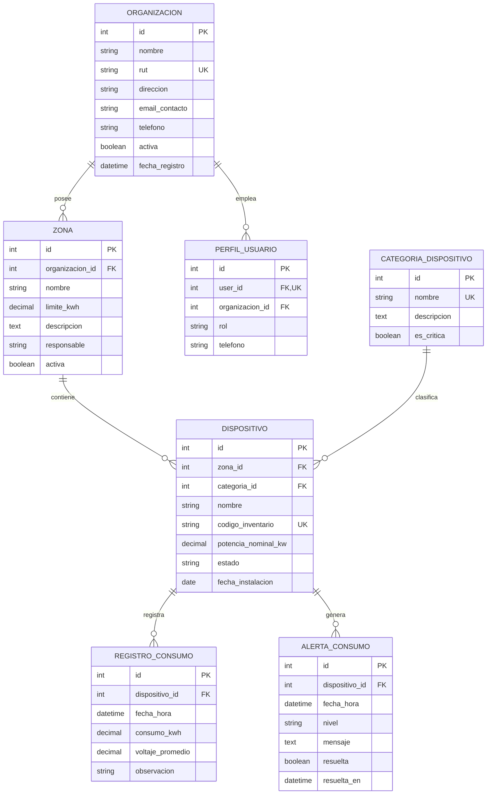

# INFORME TÉCNICO · EVALUACIÓN SUMATIVA II
## Taller: "Aplicación web con Django Admin" · Caso EcoEnergy
**Asignatura:** Programación Back End (TI3041)  
**Institución:** INACAP - Sede La Serena  
**Carrera:** Analista Programador / Ingeniería en Informática  

---

## 1. Conexión a Base de Datos y Variables de Entorno (.env)

El proyecto implementa la biblioteca `python-dotenv` para desacoplar las configuraciones sensibles del código fuente, garantizando portabilidad y seguridad tanto en entornos locales de desarrollo como en laboratorios de evaluación.

### Fragmento de `settings.py`:
```python
import os
from pathlib import Path
from dotenv import load_dotenv

# Directorio raíz del proyecto
BASE_DIR = Path(__file__).resolve().parent.parent

# Carga de variables desde el archivo .env
load_dotenv(BASE_DIR / '.env')

# Clave secreta y depuración controladas por entorno
SECRET_KEY = os.environ.get(
    'SECRET_KEY',
    'django-insecure-tf*&rw==iz2wj8$o4k6m+*ag@^a60lnce8g&o6gha)5lz@a-5_'
)
DEBUG = os.environ.get('DEBUG', 'True').lower() in ('true', '1', 'yes')

allowed_hosts_raw = os.environ.get('ALLOWED_HOSTS', '127.0.0.1,localhost')
ALLOWED_HOSTS = [h.strip() for h in allowed_hosts_raw.split(',') if h.strip()]

# Configuración dinámica del motor de Base de Datos
DB_ENGINE = os.environ.get('DB_ENGINE', 'django.db.backends.sqlite3')
DB_NAME = os.environ.get('DB_NAME', 'db.sqlite3')

if DB_ENGINE == 'django.db.backends.sqlite3':
    DATABASES = {
        'default': {
            'ENGINE': DB_ENGINE,
            'NAME': BASE_DIR / DB_NAME,
        }
    }
else:
    DATABASES = {
        'default': {
            'ENGINE': DB_ENGINE,
            'NAME': DB_NAME,
            'USER': os.environ.get('DB_USER', ''),
            'PASSWORD': os.environ.get('DB_PASSWORD', ''),
            'HOST': os.environ.get('DB_HOST', ''),
            'PORT': os.environ.get('DB_PORT', ''),
        }
    }
```

El repositorio incluye la plantilla `.env.example`, y el archivo `.env` se encuentra convenientemente ignorado en `.gitignore` para cumplir con las directrices de seguridad de software.

---

## 2. Diagrama Entidad-Relación y Estructura de Datos

El modelo implementa **4 Tablas Maestras** y **2 Tablas Operativas**, además de un modelo de perfil para la extensión y asociación de usuarios.



### Explicación de Tablas Maestras:
1. **`Organizacion`**: Entidad multiempresa raíz. Permite aislar los datos de cada cliente corporativo de EcoEnergy (requerimiento clave para scoping).
2. **`CategoriaDispositivo`**: Catálogo que clasifica los activos de consumo eléctrico (p. ej., *Maquinaria Pesada*, *Climatización*, *Refrigeración*, *Iluminación*).
3. **`Zona`**: Dependencias físicas o áreas operativas de una organización con un límite máximo mensual de consumo en kWh.
4. **`Dispositivo`**: Activos eléctricos instalados en una zona, con potencia nominal, categoría y estado operativo.
5. *(Soporte)* **`PerfilUsuario`**: Vincula usuarios de Django `auth.User` con una organización para restringir el alcance de visualización.

### Explicación de Tablas Operativas:
1. **`RegistroConsumo`**: Telemetría y mediciones periódicas de consumo en kWh y voltaje tomadas por dispositivo.
2. **`AlertaConsumo`**: Incidencias operacionales, sobreconsumos o eventos anómalos detectados, con niveles de severidad (`BAJA`, `MEDIA`, `ALTA`, `CRITICA`) y trazabilidad de resolución.

---

## 3. Usuarios de Prueba y Evidencia de Diferencias de Acceso

Se definieron 3 usuarios de prueba documentados para la defensa técnica:

| Usuario | Contraseña | Rol | Contexto de Organización | Alcance en Django Admin |
| :--- | :--- | :--- | :--- | :--- |
| **`admin`** | `AdminPassword123!` | Superadministrador | Global (Sin restricción) | Visualiza y edita todas las organizaciones, zonas, dispositivos, mediciones y alertas del sistema. |
| **`operador_norte`** | `OperadorNorte123!` | Operador de Monitoreo | **EcoIndustrias Norte S.A.** | Solo visualiza, crea y edita registros correspondientes a **EcoIndustrias Norte S.A.**. No tiene acceso a datos de EcoRetail Sur. |
| **`operador_sur`** | `OperadorSur123!` | Operador de Monitoreo | **EcoRetail Sur SpA** | Solo visualiza, crea y edita registros de **EcoRetail Sur SpA**. No tiene acceso a datos de EcoIndustrias Norte. |

---

## 4. Personalización del Administrador de Django (Admin Básico)

Cada modelo cuenta con su respectiva clase `ModelAdmin` en `monitoreo/admin.py`, configurando:
- **`list_display`**: Columnas estratégicas para auditoría rápida (nombres, estados, consumos, organizaciones, fechas).
- **`search_fields`**: Búsqueda textual por nombre, código de inventario, RUT o zona asociada.
- **`list_filter`**: Filtros laterales dinámicos por estado, categoría, severidad o fecha.
- **`ordering`**: Ordenamiento lógico por defecto.
- **`list_select_related`**: Optimización de consultas SQL (eliminando el problema del *N+1*) en modelos que visualizan relaciones `ForeignKey`:
  - `ZonaAdmin`: `list_select_related = ('organizacion',)`
  - `DispositivoAdmin`: `list_select_related = ('zona', 'categoria', 'zona__organizacion')`
  - `RegistroConsumoAdmin`: `list_select_related = ('dispositivo', 'dispositivo__zona', 'dispositivo__zona__organizacion')`
  - `AlertaConsumoAdmin`: `list_select_related = ('dispositivo', 'dispositivo__zona', 'dispositivo__zona__organizacion')`

---

## 5. Implementación de Admin Pro

### 5.1 Inlines
- **`DispositivoInline` (`admin.TabularInline`) en `ZonaAdmin`:** Permite al operador consultar y dar de alta dispositivos directamente desde la vista de edición de una Zona, visualizando de inmediato el inventario asociado sin cambiar de pantalla.
- **`RegistroConsumoInline` en `DispositivoAdmin`:** Muestra las últimas lecturas de telemetría directamente en la ficha del equipo.

### 5.2 Acciones Personalizadas (`@admin.action`)
- **En `DispositivoAdmin`:**
  - `marcar_en_mantenimiento`: Actualiza masivamente el estado de los dispositivos seleccionados a `MANTENIMIENTO` y notifica al usuario con un mensaje de éxito.
  - `marcar_como_activo`: Reactiva en lote los dispositivos seleccionados.
  - `desactivar_dispositivos`: Pasa los dispositivos seleccionados a estado inactivo.
- **En `AlertaConsumoAdmin`:**
  - `marcar_como_resueltas`: Filtra las alertas seleccionadas no resueltas y las actualiza a `resuelta=True`, asignando la marca temporal actual (`resuelta_en=timezone.now()`).

### 5.3 Validaciones Controladas mediante `clean()`
Cada modelo ejecuta reglas de negocio que impiden el registro de datos corruptos o ilógicos, devolviendo mensajes legibles mediante `ValidationError`:
- **En `Zona.clean()`**: Valida que `limite_kwh` sea estrictamente mayor a 0 kWh.
  ```python
  if self.limite_kwh is not None and self.limite_kwh <= 0:
      raise ValidationError({'limite_kwh': 'El límite de consumo debe ser un valor positivo estrictamente mayor a 0 kWh.'})
  ```
- **En `Dispositivo.clean()`**: Si un equipo está en estado `ACTIVO`, su potencia nominal debe ser superior a 0 kW.
- **En `RegistroConsumo.clean()`**: El consumo no puede ser negativo y la fecha de medición no puede encontrarse en el futuro.

---

## 6. Seguridad y Scoping por Organización

Para el caso **EcoEnergy**, se implementó un mecanismo de aislamiento a nivel de QuerySet y formularios en cada `ModelAdmin`:

1. **Aislamiento en Listados (`get_queryset`)**:
   ```python
   def get_queryset(self, request):
       qs = super().get_queryset(request)
       org = get_user_org(request)
       if org:
           return qs.filter(zona__organizacion=org)
       return qs
   ```
2. **Aislamiento en Selectores de Llave Foránea (`formfield_for_foreignkey`)**:
   Al crear o editar un registro, el usuario limitado solo puede seleccionar zonas y dispositivos de su propia organización, impidiendo que vincule registros ajenos.
3. **Protección de Permisos por Objeto (`has_change_permission`, `has_delete_permission`)**:
   Si un usuario manipula directamente la URL en el navegador para editar un ID correspondiente a otra empresa, Django Admin deniega la acción y bloquea la operación.

---

## 7. Mecanismo Reproducible de Carga de Datos y Levantamiento

El proyecto dispone del comando personalizado de Django:
```bash
python manage.py poblar_datos --limpiar
```

Este comando automatiza el 100% de la preparación del entorno:
1. Crea los grupos y asigna los permisos necesarios de Django a los operadores.
2. Crea los 3 usuarios de prueba con sus respectivas contraseñas cifradas y perfiles de scoping.
3. Carga 2 Organizaciones distintas, 4 Categorías, 5 Zonas, 6 Dispositivos, 7 Registros de Consumo y 3 Alertas.

Para levantar el sistema desde un entorno limpio:
```bash
# 1. Crear y activar entorno virtual
python -m venv .venv
.\.venv\Scripts\activate

# 2. Instalar dependencias
pip install -r requirements.txt

# 3. Crear archivo .env desde la plantilla
Copy-Item .env.example .env

# 4. Migrar y poblar
python manage.py migrate
python manage.py poblar_datos --limpiar

# 5. Ejecutar tests o servidor
python manage.py test monitoreo
python manage.py runserver
```
